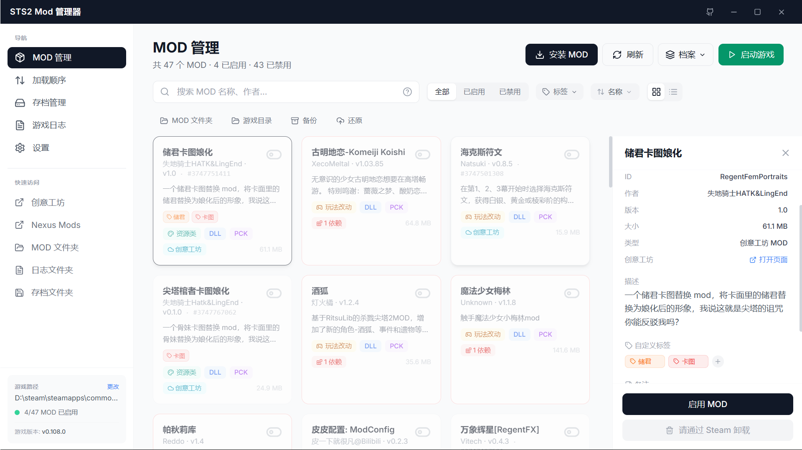
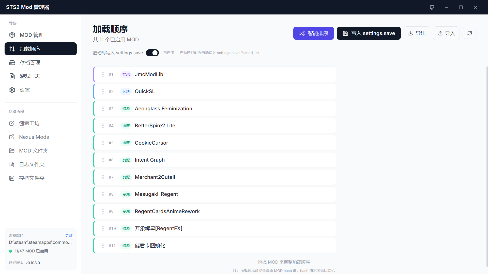

<div align="center">

# 🃏 STS2 Mod Manager

**给杀戮尖塔 2 玩家的 MOD 管理工具**

不用再手动复制文件夹了。装、删、开、关，拖进来就完事。

[](https://github.com/DZX66/sts2-mod-manager/releases)
[](https://github.com/DZX66/sts2-mod-manager)
[](LICENSE)

<br>



<br><br>



<br><br>


</div>

<br>

---

<br>

## ✨ 亮点

| | 功能 | 说明 |
|---|---|---|
| 📦 | **MOD 管理** | 安装 / 卸载 / 启用 / 禁用，支持拖拽 `.zip` 直接安装 |
| 🏷️ | **风险信号** | 自动标出缺失依赖、区分框架前置 / 玩法改动 / 资源类 MOD，一眼看清能不能安全启用 |
| 🔗 | **依赖跳转** | 详情面板中点击依赖项直接跳转到对应 MOD |
| 🔀 | **智能排序** | 按名称 / 依赖问题优先 / 影响玩法 / 分类 / 大小排序 |
| 🔢 | **加载顺序** | 拖拽调整 MOD 加载顺序，解决加载冲突 |
| 🔎 | **标签筛选** | 按标签快速筛选 MOD，支持自定义标签与颜色标记 |
| 🖼️ | **双视图模式** | 卡片网格视图（默认）和双栏列表视图随时切换 |
| 🧭 | **首次引导** | 3 步卡片式引导流程：选目录 → 装 MOD → 启动验证，新手友好 |
| ⚠️ | **操作确认** | 卸载、批量卸载、应用配置、还原备份等风险操作弹出确认，说明后果再执行 |
| 💾 | **存档管理** | 普通存档 & MOD 存档分开展示，一键导出备份、导入还原 |
| 📋 | **游戏日志** | 实时查看最新日志，出问题秒定位 |
| 🌐 | **MOD 翻译** | 英文描述看不懂？一键翻译成中文 |
| ⚙️ | **配置档案** | 保存 MOD 启用方案，联机 / 单机随时切换 |
| 🚀 | **启动游戏** | Steam 正版、非 Steam 版都支持，自动识别 |

<br>

> 本仓库为 [ImogeneOctaviap794/sts2-mod-manager](https://github.com/ImogeneOctaviap794/sts2-mod-manager) 的增强分支，继承上游全部功能的基础上新增了以下特性：

---

## ⭐ 新增功能（相比上游）

### 🌍 多语言支持（本地化）
<p>完整的中文 / 英文界面切换，基于 React Context + JSON 翻译文件，所有界面文案均已本地化。在设置页一键切换语言，无需重启。</p>

### 🎨 深色 / 浅色主题
<p>支持「浅色」「深色」「跟随系统」三种主题模式。选择跟随系统时自动适配 Windows 主题设置，保护双眼。</p>

### ⚙️ 设置页面
<p>集中管理所有偏好设置：<br>
- 🎨 外观主题切换<br>
- 🌐 界面语言选择<br>
- 🎮 游戏路径配置<br>
- 📦 智能安装开关<br>
- 🔄 Steam 用户切换</p>

### 🧩 Steam 创意工坊支持
<p>直接检测当前 Steam 用户，扫描创意工坊订阅目录，将创意工坊 MOD 自动纳入管理。在 MOD 列表中标记为「创意工坊 MOD」，支持查看启用状态、显示创意工坊 ID，一键打开创意工坊页面。<br>
<sub>创意工坊 MOD 的卸载需通过 Steam 客户端操作。</sub></p>

### 🤖 智能安装模式
<p>安装 MOD 时自动分析压缩包结构：<br>
- 若 ZIP 根目录直接包含 MOD 文件，自动创建以 MOD 名称 + 版本号命名的文件夹<br>
- 若 ZIP 根目录已是单文件夹，直接使用<br>
- 可在设置页关闭智能模式，使用传统安装方式</p>

### 📝 MOD 备注功能
<p>在 MOD 详情页可以为每个 MOD 添加文本备注，方便记录安装原因、注意事项、兼容性问题等。备注数据持久化保存，重启管理器不丢失。</p>

### 🎯 游戏版本兼容性检测
<p>解析游戏 <code>release_info.json</code> 获取当前游戏版本，与 MOD 清单中的 <code>min_game_version</code> 字段比对。游戏版本过低时在 MOD 卡片和详情页显示兼容性警告，避免加载不兼容 MOD 导致崩溃。</p>

### 📊 改进的日志分析
<p>增强日志分析引擎，更准确地识别错误（Error）和警告（Warning）级别，崩溃分析报告更加精确，帮助快速定位问题 MOD。</p>

### 🔄 新版 MOD 清单适配
<p>适配 STS2 新版 MOD 清单格式：<br>
- 支持 <code>min_game_version</code> 版本要求字段<br>
- 支持新版 <code>dependencies</code> 依赖声明格式<br>
- 忽略版本号开头的 <code>"v"</code> 前缀，兼容更多 MOD</p>

### 🛠 档案切换重构
<p>重新实现配置档案的切换逻辑，解决了存档管理中 MOD 状态不一致的问题。应用配置时支持检测缺失 MOD 和版本不匹配，并提供「忽略继续」和「更新配置」两种处理方式。</p>

### 🔢 MOD 加载顺序管理
<p>在弹窗中通过拖拽调整 MOD 的加载顺序，解决 MOD 之间的加载冲突问题。</p>

### 🏷️ 自定义标签
<p>支持为每个 MOD 添加自定义标签，并设置标签颜色。结合标签筛选功能，可快速过滤出特定分类的 MOD，管理大量 MOD 更加得心应手。</p>

### 🔔 版本更新通知
<p>进入设置页时自动检查 GitHub 最新版本，发现新版本时弹出更新窗口，直接显示更新日志内容，方便了解新功能后再决定是否升级。</p>

<br>

---

## 📥 下载

👉 [**点这里下载最新版**](https://github.com/DZX66/sts2-mod-manager/releases)

> 安装包约 4MB，内置 WebView2 引导。Win10 / Win11 直接运行。

<br>

## 🚀 上手

1. 双击打开，管理器会自动找到你的游戏
2. 找不到？左下角点一下手动选目录，只需选一次
3. 装 MOD — 点「安装 MOD」选文件，或者**直接拖进窗口**
4. 开玩

<br>

## 🛠 本地开发

```bash
npm install              # 装依赖
npm run tauri:dev        # Tauri 开发模式
npm run tauri:build      # Tauri 打包
npm run dev              # Electron 开发模式
```

> Tauri 打包需要 [Rust](https://rustup.rs/) + [VS Build Tools](https://visualstudio.microsoft.com/visual-cpp-build-tools/)（勾选 C++ 桌面开发）

<br>

## 📐 技术栈

```
前端    React 18 + TailwindCSS + Lucide Icons
后端    Rust (Tauri v2)
打包    NSIS 安装包 (~4MB)
备选    Electron 版本代码也保留着
```

<br>

## 📁 项目结构

```
src/              前端源码 (React)
src-tauri/        后端源码 (Rust)
dist-tauri/       前端构建产物
main.js           Electron 主进程
preload.js        Electron 预加载
docs/             截图素材
```

<br>

---

<div align="center">
<sub>MIT License · 给个 ⭐ 就是最大的支持</sub>
<br>
<sub>上游仓库：<a href="https://github.com/ImogeneOctaviap794/sts2-mod-manager">ImogeneOctaviap794/sts2-mod-manager</a></sub>
</div>